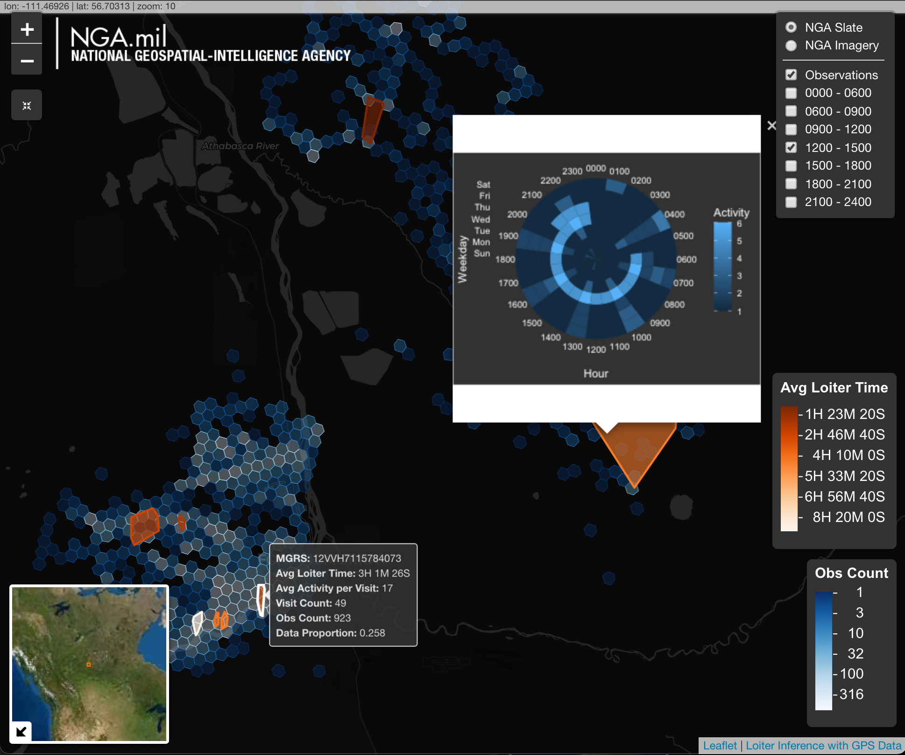

The rapid growth of spatial-temporal data is advancing analysts' targetting capabilities. With the abundance of available GPS data, analysts can study an individual’s pattern of life, which is a critical step in the F3EA targeting cycle and is used to inform decisions about applying lethal or non-lethal effects. Visibility on when an individual stops, how long they stop, and when they are in-transit can aid in characterizing an area of interest, especially in areas when other information is sparse such as parts of Africa. Analysts currently use spatial density based clustering techniques to glean insights from large GPS data sets, which has proved vital in characterizing areas of interest by identifying areas where observations occur relatively close together. This tutorial offers a method to employ Hierarchical Density Based Spatial Clustering of Application with Noise (HDBSCAN) on both spatial and temporal information. We found that clustering with HDBSCAN spatially and temporally can overcome the known disadvatages of common density based clustering methods and yield reliable loiter information to inform a pattern of life.

[Interactive Map](./products/resultMap.html)
